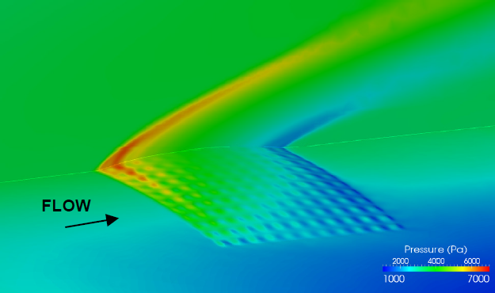

# Abaqus Module
This module was developed by [ATA Engineering](http://www.ata-e.com) as an 
add-on to the Loci/CHEM computational fluid dynamics (CFD) solver. The module 
can be used to couple Loci/CHEM to the computational structural dynamics (CSD)
solver Abaqus. The module uses the Simulia Co-Simulation Engine (CSE) API to
map data between the fluid and solid meshes. The CSE is responsible for 
synchronizing the solvers in time and passing data between them through memory
instead of file I/O. Both mechanical and thermal coupling are supported in time 
accurate, quasi-static, and steady state manners. Mechanical coupling for
aeroelastic simulations involves Loci/CHEM importing displacements on the 
interface surface from Abaqus. Loci/CHEM will the morph its mesh as a result of
these displacements, and calculate the aerodynamic forces on the interface
surface. These forces are exported to Abaqus and applied to the finite element
model (FEM). Thermal coupling works in a similar fashion, where Loci/CHEM will
import a temperature on the interface surface and export a heat flux on that 
same surface to Abaqus.

    
     
    Pressure contours on a complient panel [1].

# References
[1] Blades, E.L., P.N. Shah, M. Nucci, and R.S. Miskovish. Demonstration of
    Multiphysics Analysis Tools on Representative Hypersonic Vehicle Structures.
    54th AIAA Structures, Structural Dynamics, and Materials Conference. April
    8-11, 2013, Boston, Massachusetts.  
[2] Blades, E.L., et al. Towards a Coupled Multiphysics Analysis Capability for 
    Hypersonic Vehicle Structures. 52nd AIAA Structures, Structural Dynamics, 
    and Materials Conference. April 4-7, 2011, Denver, Colorado.  
[3] Blades, E.L., et al. A Multiphysics Simulation Capability Using the 
    Simulia Co-Simulation Engine. 20th AIAA Computational Fluid Dynamics
    Conference. June 27-30, 2011, Honolulu, Hawaii.

# Dependencies
This module depends on both Loci and CHEM being installed. Loci is an open
source framework developed at Mississippi State University (MSU) by Dr. Ed 
Luke. The framework provides a rule-based programming model and can take 
advantage of massively parallel high performance computing systems. CHEM is a 
full featured open source CFD code with finite-rate chemistry built on the Loci 
framework. CHEM is export controlled under the International Traffic In Arms 
Regulations (ITAR). Both Loci and CHEM can be obtained from the 
[SimSys Software Forum](http://www.simcenter.msstate.edu) hosted by MSU.

This module also leverages the CSE and is intended for co-simulation with an 
Abaqus FEM, so licenses for the CSE and Abaqus are required.

# Obtaining The Module
The source code for the module is freely available to the US Government under
SBIR data rights. For more information and to request a copy please contact 
mnucci@ata-e.com.